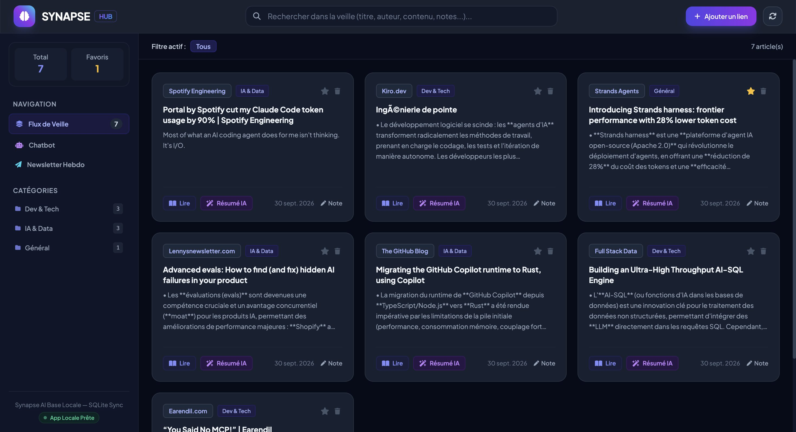

# ⚡ SYNAPSE - Hub de Veille Technologique & IA

**SYNAPSE** est un hub de veille technologique local intelligent couplé à une extension Chrome (Manifest V3). Il permet d'ajouter en 1 clic tout article, actu ou post LinkedIn à votre base de données locale SQLite et d'exploiter la puissance des modèles **Google Vertex AI Gemini**.

---

## 📸 Aperçu Visuel

### Dashboard Web (`http://localhost:8000`)


### Extension Chrome (Manifest V3)


---

## 🚀 Fonctionnalités Clés

- **Extension Chrome (Manifest V3)** :
  - Ingestion automatique des articles web avec extraction du texte intégral.
  - Détection propre du nom de domaine source (`Lemonde.fr`, `Full Stack Data Lab`, `Github.com`).
  - Bouton marque-page 🔖 natif sous chaque post LinkedIn.

- **Dashboard Web Modern Glassmorphism (`http://localhost:8000`)** :
  - **Flux de Veille** : Cartes interactives avec double mode **`📖 Lire`** (article complet) et **`✨ Résumé IA`** (synthèse Gemini à la volée).
  - **💬 Chatbot d'Article** : Chat interactif en bas de la modale de chaque article avec support de la **recherche Web**.
  - **🤖 Chatbot Général** : Assistant IA interrogeant l'ensemble de votre base de connaissances.
  - **📰 Newsletter Hebdo** : Génération en 1 clic d'un digest structuré par thématique en Markdown.

---

## 📖 Documentation MkDocs

La documentation complète du projet est disponible en ligne sur **[LucasHeral.github.io/synapse](https://LucasHeral.github.io/synapse/)**.

Pour servir la documentation localement :
```bash
make docs-serve
```

---

## 🛠️ Installation & Démarrage avec `uv`

### Prérequis
- Python 3.9+
- [uv](https://github.com/astral-sh/uv)

### 1. Installation des dépendances
```bash
make install
```

### 2. Lancer le serveur backend
```bash
make dev
```
Accédez à l'interface sur **http://localhost:8000**.

### 3. Exécuter les linters & pre-commit
```bash
make lint
make format
make precommit
```

---

## 🧩 Extension Chrome

1. Ouvrez `chrome://extensions` dans Google Chrome.
2. Activez le **Mode développeur** (en haut à droite).
3. Cliquez sur **Charger l'extension non empaquetée** et sélectionnez le dossier `chrome-extension/`.

---

## 📜 Licence
MIT License © 2026 Lucas Heral.
