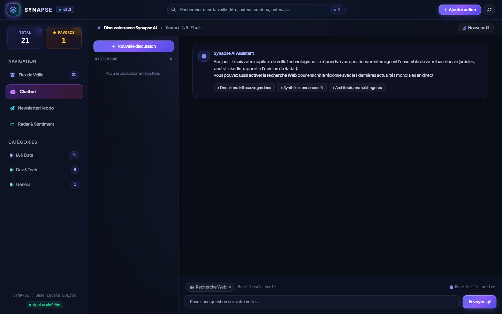
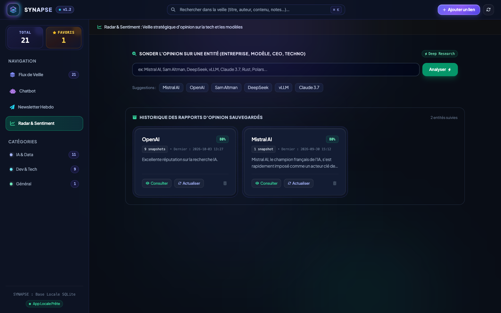

# ⚡ SYNAPSE - Hub de Veille Technologique & IA

**SYNAPSE** est un hub de veille technologique et d'intelligence stratégique local, couplé à une extension Chrome (Manifest V3) et propulsé par les modèles **Google Vertex AI Gemini**. Conçu avec une interface haute facture (châssis *Double-Bezel*, palette *Cosmic Navy*, retours tactiles), il regroupe flux d'actualités, résumés automatiques, chatbot RAG avec mémoire et radar contradictoire d'opinion.

---

## 📸 Aperçu Visuel

### 1. Dashboard Web & Flux de Veille (`http://localhost:8000`)
> Grille de cartes nivelées, filtres segmentés (`Tous` / `Favoris`), badges catégoriels colorés et double mode **`Lire`** (lecture complète) / **`Résumé IA`** (synthèse Gemini à la volée).


### 2. Chatbot IA avec Historique 2-Colonnes & Recherche Web Hybride
> Assistant conversationnel interrogeant l'ensemble de votre base de connaissances locale, avec reprise des fils de discussion, rendu Markdown soigné et toggle de **Recherche Web en direct**. Chaque source citée offre un bouton **`Carte`** (modale interne) et **`Source ↗`** (lien externe direct).



### 3. Radar d'Opinion & Veille Contradictoire (Deep Research)
> Cartographie d'opinion automatisée avec jauge de sentiment, identification des points forts (Pros) et controverses/risques cachés (Cons) sourcés, suivi multi-snapshots temporels et détection d'évolution qualitative.



### 4. Extension Chrome (Manifest V3)
> Ingestion en 1 clic de tout article avec extraction du texte épuré et bouton marque-page 🔖 natif sous chaque post LinkedIn.


---

## 🚀 Fonctionnalités Clés

- **Extension Chrome (Manifest V3)** :
  - Ingestion automatique des articles web avec extraction du texte intégral via Trafilatura.
  - Détection propre du domaine source (`Lemonde.fr`, `GitHub.com`, `Huggingface.co`).
  - Marque-page natif injecté directement sous les posts LinkedIn.
- **Dashboard Web Ultra-Premium** :
  - **Flux de Veille** : Cartes matérielles double-bezel, filtres par catégorie et favoris.
  - **💬 Chatbot d'Article** : Chat dédié en modale sur le texte d'un article spécifique.
  - **🤖 Chatbot Général Multi-Fils** : Historique complet persistant, mémoire contextuelle et recherche Web hybride.
  - **📊 Radar d'Opinion** : Recherche contradictoire avec Google Search Grounding et timeline temporelle d'évolution.
  - **📰 Newsletter Hebdo** : Génération en 1 clic d'un digest thématique en Markdown.

---

## 🛠️ Installation & Démarrage avec `uv`

### Prérequis
- **Python 3.10+**
- [uv](https://github.com/astral-sh/uv)

### 1. Installation des dépendances
```bash
make install
```

### 2. Lancer le serveur backend
```bash
make dev
```
Accédez à l'interface sur **http://localhost:8000**.

### 3. Exécuter la suite de tests & linters
```bash
make lint       # Vérification ruff
make format     # Formatage automatique ruff
make test       # Tests pytest
```

---

## 🤖 Automatisation GitHub Actions & Claude Code

Des workflows GitHub Actions automatisent le cycle de vie du code avec Claude Code (`claude.yml`, `claude-review.yml`, `let-claude-cook.yml`, `let-claude-scope.yml`).

### ⚠️ Configuration obligatoire des Secrets GitHub

Pour que les actions Claude Code fonctionnent sur votre dépôt GitHub, vous **devez impérativement renseigner vos clés et URLs d'API dans les Secrets GitHub** :

| Secret GitHub | Description | Exemple / Valeur typique |
| :--- | :--- | :--- |
| `LITELLM_BASE_URL` | URL de base de votre passerelle LiteLLM ou proxy Anthropic | `https://llmgateway.artechfact.fr` (ou votre endpoint) |
| `LITELLM_API_KEY` | Clé d'API d'authentification LiteLLM / Anthropic | `sk-...` |

#### Procédure de configuration sur GitHub :
1. Rendez-vous sur votre dépôt : `https://github.com/LucasHeral/synapse`
2. Ouvrez l'onglet **Settings** $\rightarrow$ **Secrets and variables** $\rightarrow$ **Actions**.
3. Cliquez sur **New repository secret**.
4. Créez le secret `LITELLM_BASE_URL` et collez l'URL de votre passerelle.
5. Créez le secret `LITELLM_API_KEY` et collez votre clé d'API.

---

## 🧩 Extension Chrome

1. Ouvrez `chrome://extensions` dans Google Chrome.
2. Activez le **Mode développeur** (en haut à droite).
3. Cliquez sur **Charger l'extension non empaquetée** et sélectionnez le dossier `chrome-extension/`.

---

## 📖 Documentation MkDocs

La documentation complète du projet est disponible en ligne sur **[LucasHeral.github.io/synapse](https://LucasHeral.github.io/synapse/)**.

Pour servir la documentation localement :
```bash
make docs-serve
```

---

## 📜 Licence
MIT License © 2026 Lucas Heral.
